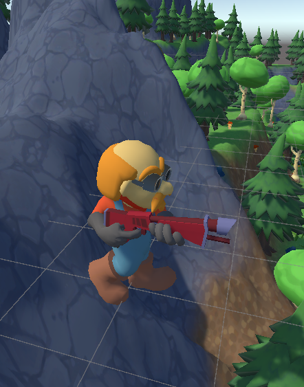

# ZombieSurvival
* 플레이 영상 : <https://youtu.be/WEAWCcp3GR4>
* 다운로드 : <https://naver.me/GJ5cFw67>
  


***

* 작업 기간 : 2025. 05. 01 ~ 2025. 05. 24 (1달)
* 인력 구성 : 1명
* 사용언어 및 개발환경 : C#, Unity
  
# FSM
* 복잡한 상태 전환을 명확히 관리하기 위하여 FSM 사용
***
  <table>
  <tr>
    <th>Idle</th>
    <th>Walk</th>
    <th>Fire</th>
    <th>Death</th>
 </tr>
  <tr>
    <td></td>
    <td></td>
    <td></td>
    <td></td>
</tr>
</table>

<details>
<summary>FSM 코드</summary>
	
```cs
// FSM 관리 클래스
public class FSMManager
{
    // FSM 다음 행동을 저장한 딕셔너리
    public Dictionary<(State, Trigger), State> stateTransitionDict = new Dictionary<(State, Trigger), State>();

    // FSM 행동을 전부 추가
    public void Init()
    {
        stateTransitionDict.Add((State.Move, Trigger.InAttackDistance), State.Attack);
        stateTransitionDict.Add((State.Attack, Trigger.OutAttackDistance), State.Move);
    }

    // FSM 현재 상태에서 트리거에 따라 다음 행동을 가져옴
    public State Transition(State currentState, Trigger trigger)
    {
        return stateTransitionDict[(currentState, trigger)];
    }
}


// 움직이는 캐릭터들이 상속 받을 클래스
public class BaseCharacter : BaseObject
{
    // FSM에서 현재 상태
    private State _CurrentState = State.Move;
    public State CurrentState { get { return _CurrentState; } }

    // 현재 상태와 트리거를 기반으로 다음 상태를 가져옴
    public void SetCurrentState(Trigger trigger)
    {
        _CurrentState = stateObserver.Invoke(_CurrentState, trigger);
        CurrentAction = stateActionDict[_CurrentState];
    }

    // 여기서 초기화
    // 상태에 따른 행동 딕셔너리
    private Dictionary<State, Action> stateActionDict = new Dictionary<State, Action>();
  
    // 현재 상태와 트리거를 기반으로 다음 상태를 가져옴
    private Func<State, Trigger, State> stateObserver;
    // 현재 실행되고 있는 액션
    private Action CurrentAction;
   
    // 유니티 함수
    protected override void Awake()
    {
        SetStateAction();
    }

    protected override void OnEnable()
    {
        // 상태 변화 함수 등록
        stateObserver = Managers.FSM.Transition;
        // 기본 상태를 Move로 등록
        CurrentAction = Move;
    }

    protected override void FixedUpdate()
    {
        base.FixedUpdate();

        if (Target != null)
        {
            CurrentAction.Invoke();
        }
    }

    // FSM State 함수
    public void Idle()
    {

    }

    // 현재 상태에서 조건을 만족하면 다른 상태로 전환
    public void Move()
    {
        objectAnimation.SetBool("IsMove", true);

        transform.LookAt(Target.transform);
        moveDirection = Target.transform.position - transform.position;
        moveDirection.y = 0;
        objectRigidBody.MovePosition(transform.position + moveDirection.normalized * objectStat.moveSpeed * Time.fixedDeltaTime);

        if (ComputeAttackDistance())
        {
            SetCurrentState(Trigger.InAttackDistance);
        }
    }

    // 현재 상태에서 조건을 만족하면 다른 상태로 전환
    private void Attack()
    {
        if (!ComputeAttackDistance())
        {
            SetCurrentState(Trigger.OutAttackDistance);
        }

        objectAnimation.SetBool("IsMove", false);
        objectAnimation.SetTrigger("IsAttack");
        transform.LookAt(Target.transform);
    }

    // 일반 함수

    // FSM에서 쓸 상태들 등록
    protected void SetStateAction()
    {
        stateActionDict.Add(State.Idle, Idle);
        stateActionDict.Add(State.Move, Move);
        stateActionDict.Add(State.Attack, Attack);
    }
}

```

</details>

# Observer Pattern
* 반복문에서 비효율적인 검사를 피하고자 사용
* HP갱신, 시민 수가 0 이 되면 게임 오버 판정, 몬스터가 0 이 되면 다음 스테이지
  
<table>
  <tr>
    <th>HP 갱신</th>
    <th>Next Stage</th>
 </tr>
  <tr>
    <td></td>
    <td></td>
</tr>
</table>

<table>
  <tr>
    <th>Citizen Zero</th>
    <th>Game Over</th>
 </tr>
  <tr>
    <td></td>
    <td></td>
</tr>
</table>

<details>
<summary>Observer Pattern 코드</summary>
	
```cs

// 최상위 부모 기본 요소 추가(타겟, hp, ui 활성화 여부, 캐릭터가 죽었을 때 행동 기본 정의)
public class BaseObject : MonoBehaviour
{
    [SerializeField]
    private GameObject _Target;

    // 관찰차 패턴(상대가 자신을 타겟으로 삼을 때 등록 죽었을 때 이벤트 발동)
    // 상대가 자신을 타겟으로 삼았을 때 타겟으로 삼은 대상을 이벤트 등록
    // 현재 대상이 체력이 0이 되면 Death에서 이벤트 발동 이 타겟말고 다른 타겟으로 바꾸게
    public GameObject Target
    {
        get { return _Target; }
        set
        { 
            _Target = value;
            _Target.GetComponent<BaseObject>().enemyObserver += ChangeTarget;
        }
    }

    [SerializeField]
    private float _hp = 0.0f;

    // 관찰자 패턴(HP가 줄어들었을 때 등록된 이벤트 발동)
    // hp가 0이 되었을 때 Death 함수 작동
    // IsViewHP를 통해 hp가 100%인 경우 ui가 보이지 않게
    // hp가 변경 될 경우 ui를 갱신
    public float hp
    {
        get { return _hp; }
        set
        {
            float prevHP = _hp;
            _hp = value;

            if (_hp - prevHP < 0)
            {
                if (hpDecreaseObserver != null)
                {
                    hpDecreaseObserver.Invoke();
                }
            }
           
            if (_hp <= float.Epsilon)
            {
                Death();
            }

            if (IsViewHP)
            {
                if (MathF.Abs(objectStat.maxhp - _hp) <= float.Epsilon)
                {
                    hpBarUI.SetActive(false);
                }
                else
                {
                    hpBarUI.SetActive(true);
                }
            }
        } 
    }

    // 아래에서 초기화
    // 나를 타겟으로 삼은 적을 등록
    public Action enemyObserver;
    // 본인이 죽었을 때 이벤트 등록
    public Action deathObserver;
    // hp가 줄어들었을 때 이벤트 등록
    public Action hpDecreaseObserver;
    
    public bool IsDeath = false;
    public bool IsViewHP = true;

    protected virtual void OnDisable()
    {
        if (_Target != null)
        {
            _Target.GetComponent<BaseObject>().enemyObserver -= ChangeTarget;
        }
    }

    // ui를 보여줄지 여부
    public void ViewHPBarUI(bool view)
    {
        IsViewHP = view;
        hpBarUI.SetActive(view);
    }

    // 캐릭터가 죽으면 할 행동
    protected virtual void Death()
    {
        IsDeath = true;

        if (_Target != null)
        {
            _Target.GetComponent<BaseObject>().enemyObserver -= ChangeTarget;
        }

        if (enemyObserver != null)
        {
            enemyObserver.Invoke();
            enemyObserver = null;
        }
       
        if (deathObserver != null)
        {
            deathObserver.Invoke();
            deathObserver = null;
        }
       
        gameObject.SetActive(false);
    }
}


// 움직이는 캐릭터들이 상속 받을 클래스
public class BaseCharacter : BaseObject
{
    // FSM에서 현재 상태
    private State _CurrentState = State.Move;
    public State CurrentState { get { return _CurrentState; } }

     // 관찰자 패턴(상태를 바꿀려고 할 때 등록된 이벤트 실행)
    // 현재 상태와 트리거를 기반으로 다음 상태를 가져옴
    public void SetCurrentState(Trigger trigger)
    {
        _CurrentState = stateObserver.Invoke(_CurrentState, trigger);
        CurrentAction = stateActionDict[_CurrentState];
    }

    // 여기서 초기화
    // 상태에 따른 행동 딕셔너리
    private Dictionary<State, Action> stateActionDict = new Dictionary<State, Action>();
   
    // 현재 상태와 트리거를 기반으로 다음 상태를 가져옴
    private Func<State, Trigger, State> stateObserver;
    // 현재 실행되고 있는 액션
    private Action CurrentAction;
  }


```

</details>

# Manager
* 통합 관리 매니저를 통해 전체 매니저 관리
* 파괴되지 않게 등록해 다른 Scene이 로드 되도 데이터가 남아있게 유지

<details>
<summary>Managers 코드</summary>
	
```cs

// 총괄 매니저 클래스 싱글턴을 통해 모든 매니저는 이 매니저 클래스를 통해 반환
public class Managers : MonoBehaviour
{
    private static Managers _instance;
    public static Managers Instance { get { Init(); return _instance; } }

    private FSMManager _FSM = new FSMManager();
    private ResourceManager _resource = new ResourceManager();
    private DataManager _data = new DataManager();
    private MemoryManager _memory = new MemoryManager();
    private ItemManager _Item = new ItemManager();
    private AnimationManager _Animation = new AnimationManager();
    private SoundManager _Sound = new SoundManager();
    
    public static FSMManager FSM { get { return Instance._FSM; } }
    public static ResourceManager Resource { get { return Instance._resource; } }
    public static DataManager Data { get { return Instance._data; } }
    public static MemoryManager Memory { get { return Instance._memory; } }
    public static ItemManager Item { get { return Instance._Item; } }
    public static AnimationManager Animation { get { return Instance._Animation; } }
    public static SoundManager Sound { get { return Instance._Sound; } }

    public static bool IsClear = false;
    
    private static void Init()
    {
        if (_instance == null)
        {
            GameObject go = GameObject.Find("@Managers");

            if (go == null)
            {
                go = new GameObject { name = "@Managers" };
                go.AddComponent<Managers>();
            }

            DontDestroyOnLoad(go);
            _instance = go.GetComponent<Managers>();

            // 매니저들 초기화 작업
            _instance._FSM.Init();
            _instance._data.Init();
            _instance._memory.Init();
            _instance._Item.Init();
            _instance._Animation.Init();
            _instance._Sound.Init();
        }
        else
        {
            if (IsClear)
            {
                Clear();
            }
        }
    }

    // 씬이 바뀔 때 매니저들 클리어 작업
    public static void Clear()
    {
        IsClear = false;
        _instance._Animation.Clear();
        _instance._data.Clear();
        _instance._Item.Clear();
        _instance._memory.Clear();
    }

    // 자식 게임 오브젝트를 찾을 때 사용
    public static GameObject FindChildObject(GameObject selfObj, string childName)
    {
        Transform[] allObjects = selfObj.transform.GetComponentsInChildren<Transform>();

        foreach (Transform obj in allObjects)
        {
            if (obj.name == childName)
            {
                return obj.gameObject;
            }
        }

        return null;
    }
}

// FSM 관리 클래스
public class FSMManager
{
    // FSM 다음 행동을 저장한 딕셔너리
    public Dictionary<(State, Trigger), State> stateTransitionDict = new Dictionary<(State, Trigger), State>();

    // FSM 행동을 전부 추가
    public void Init()
    {
        stateTransitionDict.Add((State.Move, Trigger.InAttackDistance), State.Attack);
        stateTransitionDict.Add((State.Attack, Trigger.OutAttackDistance), State.Move);
    }

    // FSM 현재 상태에서 트리거에 따라 다음 행동을 가져옴
    public State Transition(State currentState, Trigger trigger)
    {
        return stateTransitionDict[(currentState, trigger)];
    }
}

using Assets.Scripts;
using System;
using System.Collections.Generic;
using UnityEngine;

// 딕셔너리를 사용할 경우 딕셔너리 데이터를 추가하게 강제
public interface IDict<Key, Value>
{
    Dictionary<Key, Value> MakeDict();
}

// 오브젝트의 데이터 형식을 json데이터 형식과 같게 선언
[Serializable]
public class ObjectStat
{
    public string name;
    public AttackType attackType;
    public float maxhp;
    public float defense;
    public float attackSpeed;
    public float attackRange;
    public float attackRangeCorrectionValue;
    public float defaultAttackDamage;
    public float moveSpeed;
    public float projectTileSpeed;
}

[Serializable]
public class ObjectData : IDict<string, ObjectStat>
{
    // 오브젝트의 데이터 리스트
    public List<ObjectStat> objectStatList = new List<ObjectStat>();

    // 데이터 추가
    public Dictionary<string, ObjectStat> MakeDict()
    {
        Dictionary<string, ObjectStat> dict = new Dictionary<string, ObjectStat>();
        foreach (ObjectStat state in objectStatList)
        {
            dict.Add(state.name, state);
        }
        return dict;
    }
}

// 오브젝트의 데이터 형식을 json데이터 형식과 같게 선언
[Serializable]
public class StageStat
{
    public int stageNumber;
    public int zombieNumber;
    public int bossNumber;
}

[Serializable]
public class StageData : IDict<int, StageStat>
{
    // 스테이지 데이터 리스트
    public List<StageStat> stageDataList = new List<StageStat>();

    // 데이터 추가
    public Dictionary<int, StageStat> MakeDict()
    {
        Dictionary<int, StageStat> dict = new Dictionary<int, StageStat>();
        foreach (StageStat state in stageDataList)
        {
            dict.Add(state.stageNumber, state);
        }
        return dict;
    }
}

// 오브젝트의 데이터 형식을 json데이터 형식과 같게 선언
[Serializable]
public class CostStat
{
    public string name;
    public float cost;
    public int itemCost;
}

[Serializable]
public class CostData : IDict<string, CostStat>
{
    // 코스트 데이터 리스트
    public List<CostStat> costDataList = new List<CostStat>();

    // 데이터 추가
    public Dictionary<string, CostStat> MakeDict()
    {
        Dictionary<string, CostStat> dict = new Dictionary<string, CostStat>();
        foreach (CostStat state in costDataList)
        {
            dict.Add(state.name, state);
        }
        return dict;
    }
}

// 데이터 관리 클래스
public class DataManager
{
    // 오브젝트 데이터 딕셔너리
    public Dictionary<string, ObjectStat> objectDict { get; private set; } = new Dictionary<string, ObjectStat>();
    // 스테이지 데이터 딕셔너리
    public Dictionary<int, StageStat> stageDict { get; private set; } = new Dictionary<int, StageStat>();
    // 코스트 데이터 딕셔너리
    public Dictionary<string, CostStat> costDict { get; private set; } = new Dictionary<string, CostStat>();

    // 처음 초기화
    public void Init()
    {
        objectDict = LoadJson<ObjectData, string, ObjectStat>("ObjectData").MakeDict();
        stageDict = LoadJson<StageData, int, StageStat>("StageData").MakeDict();
        costDict = LoadJson<CostData, string, CostStat>("costData").MakeDict();
    }

    // 씬이 다시 로드 될 때 초기화
    public void Clear()
    {
        objectDict.Clear();
        stageDict.Clear();
        costDict.Clear();
        objectDict = LoadJson<ObjectData, string, ObjectStat>("ObjectData").MakeDict();
        stageDict = LoadJson<StageData, int, StageStat>("StageData").MakeDict();
        costDict = LoadJson<CostData, string, CostStat>("costData").MakeDict();
    }

    // json데이터 파싱
    Loader LoadJson<Loader, Key, Value>(string path) where Loader : IDict<Key, Value>
    {
        TextAsset textAsset = Managers.Resource.Load<TextAsset>($"GameData/{path}");
        return JsonUtility.FromJson<Loader>(textAsset.text);
    }
}

// 전체 메모리 관리 클래스
public class MemoryManager
{
    // 현재 씬에 있는 몬스터 수
    private int _CurrentMonsterNumber = 0;

    public int CurrentMonsterNumber
    {
        get { return _CurrentMonsterNumber; }
        set
        {
            _CurrentMonsterNumber = value;

            if (_CurrentMonsterNumber <= 0)
            {
                monsterNumberZeroObserver.Invoke();
            }
        }
    }

    // 현재 씬에 있는 시민 수
    private int _CurrentCitizenNumber = 0;

    public int CurrentCitizenNumber
    {
        get { return _CurrentCitizenNumber; }
        set
        {
            _CurrentCitizenNumber = value;

            if (armyCountObserver != null)
            {
                armyCountObserver.Invoke(_CurrentCitizenNumber);
            }

            if (_CurrentCitizenNumber <= 0)
            {
                citizenNumberZeroObserver.Invoke();
            }
        }
    }

    // 몬스터가 0이 됬을 때 이벤트
    public Action monsterNumberZeroObserver;
    // 시민이 0이 됬을 때 이벤트
    public Action citizenNumberZeroObserver;
    // 군인수에 따른 이벤트
    public Action<int> armyCountObserver;

    // 전체 메모리 리스트
    public Dictionary<string, List<BaseObject>> memoryList = new Dictionary<string, List<BaseObject>>();
    // 패널 오브젝트 관리
    public List<PanelSelect> panelUIList = new List<PanelSelect>();

    // 군인, 좀비 리스폰 포인트
    private Vector3 armyRespawnPoint = new Vector3(-5.56f, 0.0f, 26.12f);
    private Vector3 zombieRespawnPoint = new Vector3(16.63f, 0.0f, 25.84f);

    private float armySpawnRange = 3.0f;
    private float zombieSpawnRange = 5.0f;

    public void Init()
    {
        List<BaseObject> citizenList = new List<BaseObject>();
        List<BaseObject> monsterList = new List<BaseObject>();
        memoryList.Add("Citizen", citizenList);
        memoryList.Add("Monster", monsterList);
    }

    // 가까운 적을 찾을 때 사용
    public BaseObject GetNearEnemy(string enemyType, BaseObject baseObj)
    {
        if (baseObj == null) return null;

        BaseObject resultObj = null;
        float currentDis = float.PositiveInfinity;

        foreach (var obj in memoryList[enemyType])
        {
            if (obj.IsDeath) continue;
            
            Vector3 vec = obj.transform.position - baseObj.transform.position;
            float dis = Mathf.Pow(vec.x * vec.x + vec.z * vec.z, 0.5f);

            if (dis <= currentDis)
            {
                currentDis = dis;
                resultObj = obj;
            }
        }

        return resultObj;
    }

    // 씬이 바뀔 때 클리어 작업
    public void Clear()
    {
        _CurrentMonsterNumber = 0;
        _CurrentCitizenNumber = 0;
        monsterNumberZeroObserver = null;
        citizenNumberZeroObserver = null;
        armyCountObserver = null;
        panelUIList.Clear();
        memoryList["Monster"].Clear();
        memoryList["Citizen"].Clear();
    }

    
    // 스테이지가 끝나면 몬스터 메모리 정리
    public void ClearMonster()
    {
        foreach (var monster in memoryList["Monster"])
        {
            GameObject.Destroy(monster.gameObject);
        }

        memoryList["Monster"].Clear();
    }

    // 좀비 스폰
    public void SpawnZombie(int zombieCount)
    {
        for (int i = 0; i < zombieCount; i++)
        {
            Vector3 randomPos = zombieRespawnPoint + UnityEngine.Random.insideUnitSphere * zombieSpawnRange;
            randomPos.y = zombieRespawnPoint.y;
            BaseObject zombie = Managers.Resource.Instantiate("Zombie", randomPos).GetComponent<BaseObject>();
            CurrentMonsterNumber++;
            zombie.deathObserver += MinusMonsterCount;
        }
    }

    // 보스 스폰
    public void SpawnDemonCreature(int creatureCount)
    {
        for (int i = 0; i < creatureCount; i++)
        {
            Vector3 randomPos = zombieRespawnPoint + UnityEngine.Random.insideUnitSphere * zombieSpawnRange;
            randomPos.y = zombieRespawnPoint.y;
            BaseObject creature = Managers.Resource.Instantiate("DemonCreature", randomPos).GetComponent<BaseObject>();
            CurrentMonsterNumber++;
            creature.deathObserver += MinusMonsterCount;
        }
    }

    // 특정 상황에서 몬스터 타겟을 전부 리셋해야 할 때
    public void MonsterAllTargetReset()
    {
        foreach (var monster in memoryList["Monster"])
        {
            monster.ChangeTarget();
        }
    }

    // 군인 스폰
    public void ArmySpawn()
    {
        Vector3 randomPos = armyRespawnPoint + UnityEngine.Random.insideUnitSphere * armySpawnRange;
        randomPos.y = armyRespawnPoint.y;
        BaseObject obj = Managers.Resource.Instantiate("Citizen_Army", randomPos).GetComponent<BaseObject>();
        CurrentCitizenNumber++;
        obj.deathObserver += MinusCitizenCount;
    }

    // 몬스터가 죽을 때 카운트 이벤트
    private void MinusMonsterCount()
    {
        CurrentMonsterNumber -= 1;
    }

    // 시민이 죽을 때 카운트 이벤트
    private void MinusCitizenCount()
    {
        CurrentCitizenNumber -= 1;
    }
}

// 아이템 관리 클래스
public class ItemManager
{
    // 초기 돈
    private float InitialMoney = 500.0f;
    // 현재 돈
    private float _CurrentMoney = 0.0f;

    public float CurrentMoney
    {
        get { return _CurrentMoney; }
        set
        {
            _CurrentMoney = value;

            if (moneyObserver != null)
            {
                moneyObserver.Invoke(_CurrentMoney);
            }

            if (humanObserver != null)
            {
                humanObserver.Invoke(_Human);
            }

            if (foodObserver != null)
            {
                foodObserver.Invoke(_Food);
            }
        }
    }

    // 초기 인적 자원
    private int InitialHuman = 20;
    // 현재 인적 자원
    private int _Human = 0;
    public int Human
    {
        get { return _Human; }
        set
        {
            _Human = value;

            if (humanObserver != null)
            {
                humanObserver.Invoke(_Human);
            }
        } 
    }

    // 초기 음식 자원
    private int InitialFood = 20;
    // 현재 음식 자원
    private int _Food = 0;
    public int Food
    {
        get { return _Food; }
        set
        {
            _Food = value;

            if (foodObserver != null)
            {
                foodObserver.Invoke(_Food);
            }
        }
    }

    // 현재 돈 보유량이 바뀔때마다 이벤트 발생
    public Action<float> moneyObserver;
    // 인적 자원이 바뀔때마다 이벤트 발생
    public Action<int> humanObserver;
    // 음식 자원이 바뀔때마다 이벤트 발생
    public Action<int> foodObserver;

    // 처음 초기화
    public void Init()
    {
        CurrentMoney = InitialMoney;
        Human = InitialHuman;
        Food = InitialFood;
    }
    
    // 씬이 바뀔때 다시 세팅
    public void Clear()
    {
        CurrentMoney = InitialMoney;
        Human = InitialHuman;
        Food = InitialFood;
        humanObserver = null;
        foodObserver = null;
    }
}

// 애니메이션과 관련된 변수를 컨트롤
public class AnimationManager
{
    // 군인의 공격 스피드 조절
    private float _ArmyAttackSpeed = 0.0f;
    public float ArmyAttackSpeed
    {
        get { return _ArmyAttackSpeed; }
        set
        {
            _ArmyAttackSpeed = value;
            observerArmyAttackSpeed.Invoke(_ArmyAttackSpeed);
        }
    }

    // 군인의 공격 스피드가 외부에서 조절 될 때 알기 위해서
    public Action<float> observerArmyAttackSpeed;

    // 처음 초기화
    public void Init()
    {
        _ArmyAttackSpeed = Managers.Data.objectDict["Army"].attackSpeed;
    }

    // 씬이 다시 로드 될 때 초기화
    public void Clear()
    {
        _ArmyAttackSpeed = Managers.Data.objectDict["Army"].attackSpeed;
        observerArmyAttackSpeed = null;
    }
}

using System;

// 애니메이션과 관련된 변수를 컨트롤
public class AnimationManager
{
    // 군인의 공격 스피드 조절
    private float _ArmyAttackSpeed = 0.0f;
    public float ArmyAttackSpeed
    {
        get { return _ArmyAttackSpeed; }
        set
        {
            _ArmyAttackSpeed = value;
            observerArmyAttackSpeed.Invoke(_ArmyAttackSpeed);
        }
    }

    // 군인의 공격 스피드가 외부에서 조절 될 때 알기 위해서
    public Action<float> observerArmyAttackSpeed;

    // 처음 초기화
    public void Init()
    {
        _ArmyAttackSpeed = Managers.Data.objectDict["Army"].attackSpeed;
    }

    // 씬이 다시 로드 될 때 초기화
    public void Clear()
    {
        _ArmyAttackSpeed = Managers.Data.objectDict["Army"].attackSpeed;
        observerArmyAttackSpeed = null;
    }
}

// 사운드 관리자 소리 관련 총괄 관리
public class SoundManager
{
    // 중복 되지 않게 새로운 소리가 들어올 때 마다 음악 이름으로 등록
    public Dictionary<string, AudioClip> audioClipDict = new Dictionary<string, AudioClip>();
    // 소리를 그룹으로 만들어서 관리
    private AudioMixer audioMixer;
    // 소리 그룹을 불러와서 audio source를 세팅
    private AudioMixerGroup[] groups;
    // 옵션관련 UI 패널
    private GameObject optionUIPanel;

    // 각종 분야에 관련된 볼륨
    public float materVolume = 1.0f;
    public float BGMVolume = 1.0f;
    public float EffectVolume = 1.0f;

    public void Init()
    {
        audioMixer = Managers.Resource.Load<AudioMixer>($"Sound/AudioMixer");
        groups = audioMixer.FindMatchingGroups("Master");
    }
    
    // 소리 한 번 실행 용도 Effect그룹
    public void PlaySound(GameObject obj, string name)
    {
        AudioSource source = obj.GetComponent<AudioSource>();

        if (source == null)
        {
            source = obj.AddComponent<AudioSource>();
        }

        AudioClip clip = null;

        if (!audioClipDict.TryGetValue(name, out clip))
        {
            clip = Managers.Resource.Load<AudioClip>($"Sound/{name}");
            audioClipDict.Add(name, clip);
        }

        source.clip = clip;
        source.outputAudioMixerGroup = groups[2];
        
        if (!source.isPlaying)
        {
            source.Play();
        }
    }

    // 소리 한 번 실행 OneShot의 특징으로 중복 실행이 가능함 Effect 그룹
    public void PlayOneShot(GameObject obj, string name)
    {
        AudioSource source = obj.GetComponent<AudioSource>();

        if (source == null)
        {
            source = obj.AddComponent<AudioSource>();
        }

        AudioClip clip = null;

        if (!audioClipDict.TryGetValue(name, out clip))
        {
            clip = Managers.Resource.Load<AudioClip>($"Sound/{name}");
            audioClipDict.Add(name, clip);
        }

        source.outputAudioMixerGroup = groups[2];
        source.PlayOneShot(clip);
    }

    // 배경 음악용 
    public void PlayBackgroundSound(string name)
    {
        AudioSource source = Managers.Instance.gameObject.GetComponent<AudioSource>();

        if (source == null)
        {
            source = Managers.Instance.gameObject.AddComponent<AudioSource>();
        }

        AudioClip clip = null;

        if (!audioClipDict.TryGetValue(name, out clip))
        {
            clip = Managers.Resource.Load<AudioClip>($"Sound/{name}");
            audioClipDict.Add(name, clip);
        }

        source.outputAudioMixerGroup = groups[1];
        source.loop = true;
        source.clip = clip;
        source.Play();
    }

    // 그룹마다 소리 세팅
    public void SetAudioSound(SoundType type, float volume)
    {
        volume = Mathf.Clamp(volume, 0.0001f, 1.0f);

        switch (type)
        {
            case SoundType.Master:
                materVolume = volume;
                break;
            case SoundType.BGM:
                BGMVolume = volume;
                break;
            case SoundType.Effect:
                EffectVolume = volume;
                break;
        }
       
        audioMixer.SetFloat(type.ToString(), Mathf.Log10(volume) * 20);
    }

    // 씬이 바뀔 때 마다 슬라이더 변경
    public void SetMixerSlider()
    {
        GameObject obj = GameObject.Find("OptionUIPanel");
        Managers.FindChildObject(obj, "MasterSlider").GetComponent<Slider>().value = materVolume;
        Managers.FindChildObject(obj, "BGMSlider").GetComponent<Slider>().value = BGMVolume; 
        Managers.FindChildObject(obj, "EffectSlider").GetComponent<Slider>().value = EffectVolume; 
    }
}


```

<details/>


